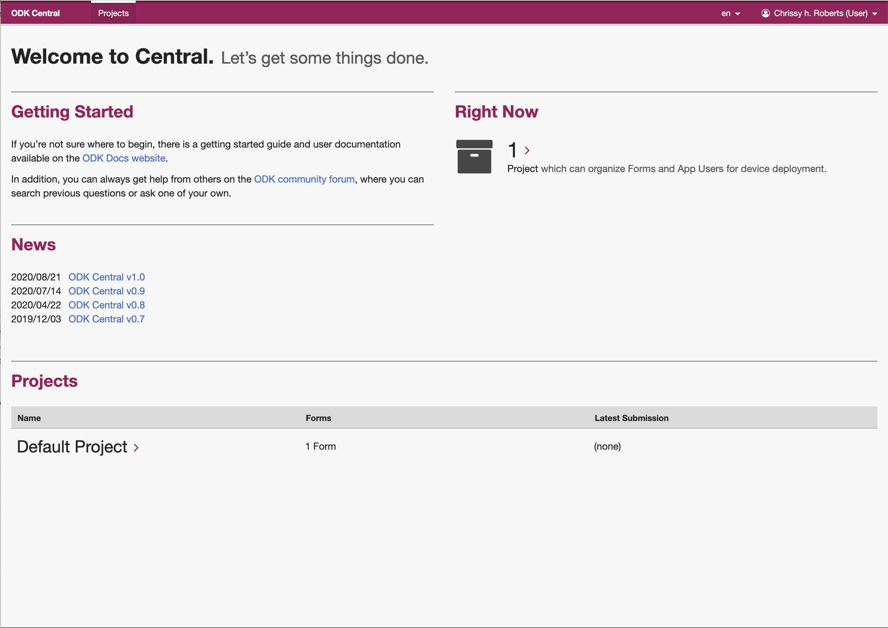
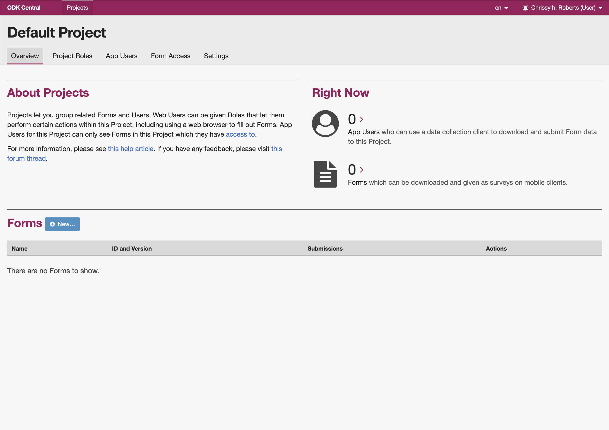
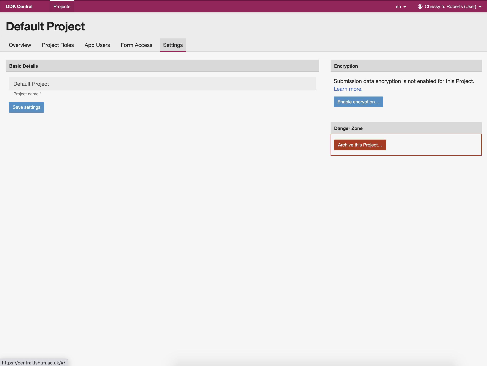

</Br>

## LSHTM ODK Server Setup Guide

**version 3.0.0 -- 2020-11-01**

</Br></Br>


## Introduction

* The majority of the support you will need to use ODK can be found in the official ODK documentation at [https://docs.getodk.org/](https://docs.getodk.org/). There you will find instructions that are both comprehensive and very well maintained by the ODK Community [https://forum.getodk.org/](https://forum.getodk.org/).

* This document provides an overview of the specific requirements for setting up and configuring an ODK Server through LSHTM's system, run by the LSHTM Global Health Analytics group in collaboration with   

* More information about other services provided by the LSHTM Global Health Analytics group can be found on our project website [odk.lshtm.ac.uk](odk.lshtm.ac.uk)

* Email queries to [*odk@lshtm.ac.uk*](mailto:ODK@LSHTM.AC.UK)
  
-

### Setting up your server


- 	**Request an ODK Server** at LSHTM by completing [this form](https://docs.google.com/forms/d/1fR-hyt3KY3dqrRyFeoKOx0DvBHm1LBc3Q1LVG9GmPWU/edit?usp=forms_home&ths=true]).  

- Each ODK project server is only for use by your team and for the specific project named in the server request form.  

- You will receive an email from `no-reply@lshtm.ac.uk` which will invite you to become a `web user` on ODK Central, the software server that runs ODK. The email will contain a link to the ODK Central server system. *This link will expire after 24 hours.*
- Click the link and you will be taken to a page where you can set your password. 

 	- A good technique for making passwords is to use four random words, put together in a memorable way
		- For instance ```grapes$CATCH£brickRED*fudge``` is a strong and memorable password. 
 		- Do not use simple replacement logic like this ```cl3v3r-pa55w0rd``` as passwords generated this way are easily cracked
 		- Please note that passwords should NOT include the name of your project, nor the year it started (i.e. `covidcomplications2020` would be a **very bad** password)

- Once you have signed in, you should see the welcome page and a list of projects that you have been assigned to as a user or project administrator. Any user can be assigned to multiple projects, but projects can only be created or archived by the system administrators. If you want to set up additional projects, then you should complete a new server request form.

 
</Br>

- If you click on the name of the project (here `Default Project`) you will be taken to the project page, which is where you will do most of the work. On this page you can add and test data collection forms, create and control access for users for the ODK Android app, or make URLs that will allow data collection via web-forms. The project page looks like this

 
</Br>
 
 
### User types

ODK Central has two types of users, these being `web users` and `app users`. 

- `Web users` are able to log in to the ODK Central server and carry out administrative tasks such as adding new forms and creating and managing `app users` and webforms. Only the LSHTM system administrators can add new `web users` to the system, but any web user who currently has an account with ODK central can be invited by the project administrator to join their project. In most cases we expect web-users to be LSHTM staff, students and honorary appointees.

- `App users` have primarily data collection roles and can not access the server website. App users may include field enumerators and partners outside LSHTM.


### Initial project settings

Before you can start collecting data, you have to change some settings. From the project page, click the `settings` tab. Here you have three options.

 

* **Archive** this project
	* This is used at the end of the study. Archiving is irreversible, so unless you are sure that you are done, don't press this button.
* **Rename** 
	* You will see the option to rename your project but **This should not be done under any circumstances**. The LSHTM system administrators use the project names to audit the use of our services across the platform and any projects which are renamed by users will be deactivated immediately.
* **Encryption**
	* Encryption protects your data and is required under our terms of service, but before you proceed with setting this up, read the rest of this document.
	
## **Encryption**

The **General Data Protection Regulation (GDPR) (EU) 2016/679** came in to force in May 2018 and this law requires that all reasonable steps should be taken to make it reasonably unlikely that personal and sensitive data relating to individuals and their health could be accessed or used by third parties without explicit consent.   

In the context of the activities on the LSHTM ODK system, we interpret this law to mean that **all data stored on our servers should be encrypted** in such a way that no person could view any data on any server through the web, even if they have a copy of the project admin's username and password. In practise this means that all data needs to be encrypted on the Android devices in the field and that only the encrypted forms of the data are stored on the server.

All *data communications* from Android devices to the LSHTM servers are secure and encrypted by default, but without additional levels of data protection your data could be vulnerable to being accessed by third parties (for instance if they guessed or cracked your password) and without further measures described below, all your data would also be visible to the LSHTM team which runs the ODK service (who have access to all projects as part of their admin privileges). By following the steps below, you can e**nsure that all your data is visible only to your team and that no data are stored in a human-readable form anywhere on the web accessible server or backup servers**.


 **PLEASE NOTE** 

* Any person storing data on LSHTM ODK servers without implementing encryption as described below may be in breach of the General Data Protection Regulation (GDPR) (EU) 2016/679  

* GDPR makes no clear distinction between the use of names and pseudonyms or ID codes. Any data which can be linked to a living individual (by any person) is considered sensitive and 'relevant' to the GDPR. 

* Fully anonymous data sets (for instance where the project leads cannot link the data back to the origin in any way) are exempt from GDPR.  

* For the avoidance of all doubt : **ALL DATA SHOULD BE ENCRYPTED** regardless of the level of anonymity


<Br> <Br>
## **Encryption options**

There are two different ways to encrypt data in ODK, both of which provide on-device and on-server data encryption protection, but each have different benefits depending on your project needs. It is therefore worth taking time to carefully consider which of the two approaches you choose as you won't be able to change your mind once you've started using one or the other.

The two methods of encryption are 

* **Project Level Encryption**
* **Form Level Encryption**
<Br><Br>

**Project level encryption** is easy to set up and is probably the best option for most users.  

- The basic function of project level encryption is that you click a button on the settings page and set a single system wide password that is then used to encrypt and decrypt your data across all forms in your project. When you want to download and decrypt your data, you provide the password and all your data will then be downloaded to your computer as a zip file containing human-readable data.  
- If you forget or lose this password, there is no way to recover it and you will lose all your data. The password is never stored on the server, but is used as the secret key for decrypting data using cyphers that are stored by the server. Because of this, the system administrators cannot under any circumstance help you to recover the password. 
- All data are encrypted using the same password, meaning that all forms are decrypted at once. If you want to allow different user groups access to different forms (for instance if team A should be able to decrypt form A and team B should be able to decrypt form B) then you should consider using `form level encryption`.
- Download of project level encrypted data is in bulk, meaning that you may run in to issues if your project is expected to have has tens or hundreds of thousands of records, or if it contains large numbers of attachments such as photos, videos and audio recordings. A future version of the central server will address this but for now, if you expect your project to get very big, then you should consider using `form level encryption`.


**Form level encryption** is a little harder to set up and should be used when


- The number of form submissions is expected to be very large (i.e. tens or hundreds of thousands)
- You are working with **lots** of form submissions that include attachments of photos, videos or audio recordings
- You want to have more granular control over access to specific forms
- You want to automate the download and processing of data

If using `form level encryption`, you will have more control over the encryption of specific forms, much better handling of very large data sets and the ability to automate processes using command line interfaces. 

As with the project level encryption, your data will be lost if you lose the decryption key file. The system administrators will have no means by which to help you retrieve the data unless you ask them to keep a copy of your decryption keys on your behalf.

Downloading and decrypting data using `form level encryption` requires the use of a piece of software called `ODK Briefcase`.

The use of `form level encryption` and `ODK briefcase` are detailed in Appendix A.


## Consult the ODK Documentation for further instructions

* Your project should now be up and running, with either `project level` or `form level encryption` in place. 
* For further instructions on how to use ODK, please refer to the official ODK documentation at [https://docs.getodk.org/](https://docs.getodk.org/).


<Br><Br><Br><Br>
---


###Appendix A : Form Level Encryption


We use **asymmetric encryption** to protect the data on our system. This process is based on the use of a pair of cypher files or "Keys". Each pair consists of a ```public key``` file, which is used for encryption and a ```private key``` which is used for decryption.

The ```private key``` is included in the ODK form on the Android devices. When a form is filled and finalised, the ODK Collect app uses the ```public key``` along with an encryption algorithm to convert the data in to an encoded (encrypted) form. Crucially, the same ```public key``` can not be used to decode (decrypt) the data, meaning that once the form is finalised, the data can not be reopened or read on the device. Any photographs, audio/video recordings and other attachments are also encrypted.  

The encrypted form of the data is sent over the internet to the LSHTM server, where it is stored and **backed up in the encrypted format**. 

To decrypt the data, it must first be downloaded from the server to your computer. A piece of software called **ODK Briefcase** is used to both download and decrypt the data. ODK Briefcase uses the ```private key``` file, meaning that only individuals who have a copy of this file (usually kept on a USB drive in a locked safe, office, filing cabinet etc) can ultimately see the human readable form of the data.

-

#### **Obtaining asymmetric encryption keys**

You will need a unique pair of asymmetric encryption key files. Depending on how you want to use them, you could choose to either...

* Use the same key pair for all your projects and forms 
	* *Most users do this*
* Use different key pairs for specific projects
	* *Useful if sharing keys with project partners on specific projects*
* Use different key pairs for specific forms 
	* *This advanced option is seldom used but can be implemented for multicentre projects where specific users should be locked out of some forms, but able to decrypt others*

There are two options for how to do obtain your encryption key pairs.  

**1. Obtain keys from LSHTM Global Health Analytics team**

When you set up your account, we will offer you a pair of encryption keys. Each set of keys can be either given to you in person on a USB drive or sent by Whatsapp, which provides a secure way to send the sensitive keys over the internet.

For backup purposes we will keep copies of all keys that we generate in our locked safe in the LSHTM Keppel Street Building.	
  
**2. Make your own keys (Advanced Users)**

Users who are familiar with such methods are welcome to generate their own keys using [OpenSSL](https://www.openssl.org). OpenSSL is pre-installed on Mac and Linux systems, but will need to be installed on Windows PCs.

A 2048 bit private key should be created (do NOT add a passcode to the key).

On Windows, a typical set of commands to create a private key, then extract a public key are...

> openssl genpkey -out MyPrivateKey.pem -outform PEM -algorithm RSA -pkeyopt rsa_keygen_bits:2048

>openssl rsa -in MyPrivateKey.pem -inform PEM -out MyPublicKey.pem -outform PEM -pubout

On Macs/Linux, these commands would be similar to...

> openssl genrsa -out MyPrivateKey.pem 2048

>openssl rsa -in MyPrivateKey.pem -inform PEM -out MyPublicKey.pem -outform PEM -pubout

In both cases you may wish to substitute ```MyPrivateKey``` and ```MyPublicKey``` for something more descriptive.

-
 
**After you have obtained your encryption key files**

You should have two files, with names something like this...

>ODK.PRIVATE.KEY.11110.pem  
>ODK.PUBLIC.KEY.11110.pem

Open the ```public key``` file in a text editor.

On Macs 

>right click the file and choose ```open with``` then ```other``` and choose ```TextEdit```

On PCs
>right click the file and choose ```open with``` and choose ```Notepad```


You should see a block of text like this
>-----BEGIN PUBLIC KEY-----  
MIIBIjANBgkqhkiG9w0BAQEFAAOCAQ8AMIIBCgKCAQEA1DXk7dbAI89DscB5M+aB
lbvtIUcelkwdYX+CBV9uHdvkCm6g0CJM0nrzjRrhKyty0hSgIRfhIBozIfEJYSwR
usz/ClGeNiL8Fz3JGYfnFWLw4ZmNKQwAz2CS/zoI4Mu7QRjmeWPIBohdjHo1hJNI
jogme0Iip4GDn+3DgsuvFYXxjkWlXN7opEkxAeBQukQzAxCiWbwdhKWKQzwgzmSu
5HqCldkkQQ1Q5Zd/KsdmejWQa/5xDd/gOJ0ql+AVzZC1Z9fE0+2HLEEQca8pgWUP
XAnPEK2BdNI/ltfPhgKOCE1inXAZxIrDSybePUIyYbIj14aQ30osMpp4EMFFU1rY
bQIDAQAB  
-----END PUBLIC KEY-----  

Copy this text and paste it in to a new text file named something like ```ODK.PUBLIC.KEY.11110.txt```

Remove the top and bottom lines...

>MIIBIjANBgkqhkiG9w0BAQEFAAOCAQ8AMIIBCgKCAQEA1DXk7dbAI89DscB5M+aB
lbvtIUcelkwdYX+CBV9uHdvkCm6g0CJM0nrzjRrhKyty0hSgIRfhIBozIfEJYSwR
usz/ClGeNiL8Fz3JGYfnFWLw4ZmNKQwAz2CS/zoI4Mu7QRjmeWPIBohdjHo1hJNI
jogme0Iip4GDn+3DgsuvFYXxjkWlXN7opEkxAeBQukQzAxCiWbwdhKWKQzwgzmSu
5HqCldkkQQ1Q5Zd/KsdmejWQa/5xDd/gOJ0ql+AVzZC1Z9fE0+2HLEEQca8pgWUP
XAnPEK2BdNI/ltfPhgKOCE1inXAZxIrDSybePUIyYbIj14aQ30osMpp4EMFFU1rY
bQIDAQAB


...and carefully remove the line breaks (returns), taking care not to delete any characters from the key. Your aim is to get all the characters on one line, as shown below.

>MIIBIjANBgkqhkiG9w0BAQEFAAOCAQ8AMIIBCgKCAQEA1DXk7dbAI89DscB5M+aBlbvtIUcelkwdYX+CBV9uHdvkCm6g0CJM0nrzjRrhKyty0hSgIRfhIBozIfEJYSwRuszClGeNiL8Fz3JGYfnFWLw4ZmNKQwAz2CSzoI4Mu7QRjmeWPIBohdjHo1hJNIjogme0Iip4GDn+3DgsuvFYXxjkWlXN7opEkxAeBQukQzAxCiWbwdhKWKQzwgzmSu5HqCldkkQQ1Q5Zd/KsdmejWQa/5xDd/gOJ0ql+AVzZC1Z9fE0+2HLEEQca8pgWUPXAnPEK2BdNI/ltfPhgKOCE1inXAZxIrDSybePUIyYbIj14aQ30osMpp4EMFFU1rYbQIDAQAB

Save the ```ODK.PUBLIC.KEY.11110.txt``` file for later. You will use this 'one-liner' key when you design your data collection forms. Please note that ODK form design is covered in a [separate guide](). For the remainder of this guide we will use a simple template form which you can download [here](./Files/tutorial_encrypted.xlsx).

-

<div style="page-break-after: always;"></div>  

#### Downloading and Decrypting Data using ODK Briefcase (Form level encryption only)


In order to be able to decrypt your data, your computer's installation of Java may need to be updated. This is because the decryption requires advanced cryptography files that are not included in all Java releases.

* Download and install [Java Development Kit V10](http://www.oracle.com/technetwork/java/javase/downloads/jdk10-downloads-4416644.html). Be sure to install the correct version for your operating system.
* Reboot your computer.  
  
* Download the most recent version of [ODK Briefcase](https://github.com/opendatakit/briefcase/releases/latest). This is a java executable file named something like ```ODK-Briefcase-v1.10.1.jar```.  
* Move the ```ODK Briefcase vx.x.x.jar``` file to a folder on your hard drive  
* Double click to open the ODK Briefcase Software. 
	* Because this is a Java Application, you may have to allow the program security privileges on some computers.  
	* On Mac OS you may need to go to ```System Preferences``` > ```security & privacy``` then unlock the preference pane and click ```Anywhere``` under the ```Allow apps downloaded from``` section.  

* Select the ```Settings``` tab
	* Click the ```Choose...``` button and select a location to which the software should pull your raw data files.   
	
	> NOTE : The folder you use for ODK Briefcase Storage should not be a folder on a filesharing system such as Dropbox, nor a folder which is automatically backed up to an unsecured drive.  


* Select the ```Pull``` tab and click the ```Configure``` button.  
* Enter the URL of your server, **this time adding the main data folder in the path**

> 	URL  
>  ```https://yourprojectname.odk.lshtm.ac.uk/yourprojectname```  

or

>  ```https://ork.lshtm.ac.uk/yourprojectname```  

>  Username  
> ```admin```  
>  Password  
> ```grapes$CATCH$brickred$fudge```  

* Press the ‘Connect’ button and ODK Briefcase should show you a list of all the forms that you can copy from the server on to your local (desktop/laptop) machine. This action is called a ‘pull’.

  


* Tick the box next to the forms you want to pull or press the ```select all``` button.  
* Press the ```Pull``` button to pull your data in to the folder you specified earlier.  
* All successfulls pulls will be flagged ```success``` in the ```Pull Status``` column. 

In your download folder you will now find that there are a number of new directories.  

	> ODK Briefcase Storage
	    >forms
	         >tutorial_encrypted
	                >instances
		>uuid….


There will be one uuid folder for each filled form that you submitted to the server.
Inside each of these folders you will find encrypted files.  

* Select the ```export``` tab and click the ```choose``` button next to ```Export Directory```. 
* Choose a directory in which to export the decrypted data. This must be a different folder to the one in which the encrypted files are stored.
* This folder should not be on Dropbox etc. nor on any folder backed up to enencrypted media.  

* Click the ```choose``` button next to ```PEM File location```.  
* Locate the private decryption key (This should be on a USB drive).  
* Select the forms you wish to decrypt.  
* Press ```Export```.   


* Export Status will change to ```Succeeded``` if everything went well. 

* In the export directory you will find a new folder called ```decrypted```
* Inside this foilder should be a csv file, which can be opened by R, STATA, Excel or text editors. Please note that Excel has poor support for non Roman characters, so surveys in other alphabets may not show correctly.
* If there are photos, videos or sound recordings in your form, there will be a ```media``` folder which contains these. The file paths to these media files will be updated automatically in the CSV document.


