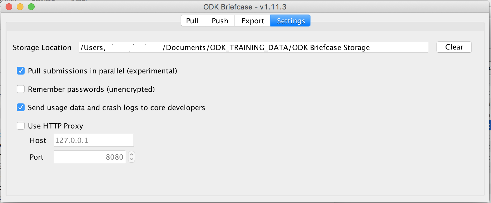

</Br>


### LSHTM Open Data Kit : Server/Device Setup Guide

**version 2.0.0 -- 2018-09-07**

</Br></Br>

### Introduction

*This is not meant to be a definitive guide to using ODK but provides an
overview of configuring your LSHTM Open Data Kit Server, devices and forms. More extensive documentation for ODK can be found at [docs.opendatakit.org](https://docs.opendatakit.org) and [xlsform.org](xlsform.org).  
More information about LSHTM Open Research Kits can be found on our project website [odk.lshtm.ac.uk](odk.lshtm.ac.uk)

##### Outcomes  
At the end of this tutorial you should will be able to do the following.

	1. Set up a new account and server
	2. Design a basic XForm for use with Open Data Kit
	3. Upload blank forms to the server
	4. Connect an Android device to the server
	5. Load blank forms to an Android device
	6. Fill in and Submit encrypted data to the server
	7. Download and decrypt data on a local workstation

Email queries to [*odk@lshtm.ac.uk*](mailto:ODK@LSHTM.AC.UK)
  
-

#### Setting up your server

1. 	**Request an ODK Server** at LSHTM by completing [this form](https://docs.google.com/forms/d/e/1FAIpQLSfz-dwv2knciYxO8651qja3MyQ6yCRhG8WjjDsBlediuNuozA/viewform]).  
 - You will receive a confirmation email which contains **the URL of your server**. This URL is only for use by your team and for the specific project named in the server request form.  
 - Usually servers are set up within 72 hours of request, but at busy times this may be longer.

2. **Access your server** using a browser (Chrome, Safari & Firefox have been tested)
 - The URL of your server will take the form ```https://yourprojectname.odk.lshtm.ac.uk```  
3. **Login** in with the username ```admin``` and the password ```lshtm```. Note that these are case sensitive.  

4. **Set the admin password**
 - Select the ```Site Admin``` tab
 - By default there are two users setup: (A) ```admin``` & (B) ```anonymoususer```
 - Change the admin user password
 - Please note that password recovery for ODK servers is not a simple process. Pick a password that you can remember but which provides strong protection.  
 - A good technique for making passwords is to use four random words, put together in a memorable way
 - For instance ```grapes$CATCH$brickred$fudge``` is a strong and memorable password. 
 - Do not use simple replacement logic like this ```cl3v3r-pa55w0rd``` as passwords generated this way are easily cracked


5. **Disable** the rights of the ```Anonymoususer``` account
 - **You must disable Anonymoususer Form Manager -- Otherwise people can
access your data without a password**
 - Deselect the checkboxes to ensure that the ```Anonymoususer``` account does *not* have ```Data Viewer``` or ```Form Manager```rights. 
 - Unless you are running a **web-form** which will be filled anonymously, it is recommended that you deselect the ```Data Collector``` box for the ```Anonymoususer``` account. This will prevent anyone without a password from submitting data to your server.
 
6. Press the ```Save``` button to commit these changes

To create a new user account

* Type a new username in the *Add Users* box and click *Add*
* Give the new username *Data Collector* rights and set a password
* Save your changes


A typical set of users might include one ```admin``` account, one account for ```data collectors```, one for a ```team leader``` (able to see and download data, but not change forms) and a ```recovery``` account which can be accessed if the admin password is lost or. misplaced. The passwords for the ```admin``` and ```recovery``` accounts should differ.  

|Username|Full Name|Account Type|Data Collector|Data Viewer|Form Manager|Site Administrator|  
|--------|---------|------------|--------------|-----------|------------|------------------|
|admin|admin|ODK||X|X|X|
|datacollector|datacollector|ODK|X||||
|fieldlead|fieldlead|ODK||X|||
|recovery|recovery|ODK||||X|

The server is now secure and should be set up multiple users.
<div style="page-break-after: always;"></div>  

#### **Setting up encryption**

All data communications from Android devices to the LSHTM servers are secure and encrypted by default, but without additional levels of data protection your data would be vulnerable to being accessed by third parties. For instance if a malicious party could obtain or guess your password for a ```data viewer``` account, then they could read and download all your study data using a web browser from anywhere in the world.

The **General Data Protection Regulation (GDPR) (EU) 2016/679** came in to force in May 2018 and this law requires that all reasonable steps should be taken to make it reasonably unlikely that personal and sensitive data relating to individuals and their health could be accessed or used by third parties without explicit consent.   

In the context of the activities of *LSHTM Open Research Kits*, we interpret this law to mean that **all data stored on our servers should be encrypted** in such a way that no person could view any data on any server through the web, even if they have a copy of the admin username and password. In practise this means that all data needs to be encrypted on the Android devices in the field, that only the encrypted forms of the data are stored on the server and that the decryption process should take place offline.

> PLEASE NOTE CAREFULLY

> Any person storing data on LSHTM ODK servers without implementing encryption as described below may be in breach of the General Data Protection Regulation (GDPR) (EU) 2016/679  

> GDPR makes no clear distinction between the use of names and pseudonyms or ID codes. Any data which can be linked to a living individual (by any person) is considered sensitive and 'relevant' to the GDPR. 

>Fully anonymous data sets (for instance where the project leads cannot link the data back to the origin in any way) are exempt from GDPR.  

> For the avoidance of all doubt : **ALL DATA SHOULD BE ENCRYPTED** regardless of the level of anonymity

 


We use **asymmetric encryption** to protect the data on our system. This process is based on the use of a pair of cypher files or "Keys". Each pair consists of a ```public key``` file, which is used for encryption and a ```private key``` which is used for decryption.

The ```private key``` is included in the ODK form on the Android devices. When a form is filled and finalised, the ODK Collect app uses the ```public key``` along with an encryption algorithm to convert the data in to an encoded (encrypted) form. Crucially, the same ```public key``` can not be used to decode (decrypt) the data, meaning that once the form is finalised, the data can not be reopened or read on the device. Any photographs, audio/video recordings and other attachments are also encrypted.  

The encrypted form of the data is sent over the internet to the LSHTM server, where it is stored and **backed up in the encrypted format**. 

To decrypt the data, it must first be downloaded from the server to your computer. A piece of software called **ODK Briefcase** is used to both download and decrypt the data. ODK Briefcase uses the ```private key``` file, meaning that only individuals who have a copy of this file (usually kept on a USB drive in a locked safe, office, filing cabinet etc) can ultimately see the human readable form of the data.

-

#### **Obtaining asymmetric encryption keys**

You will need a unique pair of asymmetric encryption key files. Depending on how you want to use them, you could choose to either...

* Use the same key pair for all your projects and forms 
	* *Most users do this*
* Use different key pairs for specific projects
	* *Useful if sharing keys with project partners on specific projects*
* Use different key pairs for specific forms 
	* *This advanced option is seldom used but can be implemented for multicentre projects where specific users should be locked out of some forms, but able to decrypt others*

There are two options for how to do obtain your encryption key pairs.  

**1. Obtain keys from LSHTM Open Research Kits team**

When you set up your account, we will offer you a pair of encryption keys. Each set of keys can be either given to you in person on a USB drive or sent by Whatsapp, which provides a secure way to send the sensitive keys over the internet.

For backup purposes we will keep copies of all keys that we generate in our locked safe in the LSHTM Keppel Street Building.	
  
**2. Make your own keys (Advanced Users)**

Users who are familiar with such methods are welcome to generate their own keys using [OpenSSL](https://www.openssl.org). OpenSSL is pre-installed on Mac and Linux systems, but will need to be installed on Windows PCs.

A 2048 bit private key should be created (do NOT add a passcode to the key).

On Windows, a typical set of commands to create a private key, then extract a public key are...

> openssl genpkey -out MyPrivateKey.pem -outform PEM -algorithm RSA -pkeyopt rsa_keygen_bits:2048

>openssl rsa -in MyPrivateKey.pem -inform PEM -out MyPublicKey.pem -outform PEM -pubout

On Macs/Linux, these commands would be similar to...

> openssl genrsa -out MyPrivateKey.pem 2048

>openssl rsa -in MyPrivateKey.pem -inform PEM -out MyPublicKey.pem -outform PEM -pubout

In both cases you may wish to substitute ```MyPrivateKey``` and ```MyPublicKey``` for something more descriptive.

-
 
**After you have obtained your encryption key files**

You should have two files, with names something like this...

>ODK.PRIVATE.KEY.11110.pem  
>ODK.PUBLIC.KEY.11110.pem

Open the ```public key``` file in a text editor.

On Macs 

>right click the file and choose ```open with``` then ```other``` and choose ```TextEdit```

On PCs
>right click the file and choose ```open with``` and choose ```Notepad```


You should see a block of text like this
>-----BEGIN PUBLIC KEY-----  
MIIBIjANBgkqhkiG9w0BAQEFAAOCAQ8AMIIBCgKCAQEA1DXk7dbAI89DscB5M+aB
lbvtIUcelkwdYX+CBV9uHdvkCm6g0CJM0nrzjRrhKyty0hSgIRfhIBozIfEJYSwR
usz/ClGeNiL8Fz3JGYfnFWLw4ZmNKQwAz2CS/zoI4Mu7QRjmeWPIBohdjHo1hJNI
jogme0Iip4GDn+3DgsuvFYXxjkWlXN7opEkxAeBQukQzAxCiWbwdhKWKQzwgzmSu
5HqCldkkQQ1Q5Zd/KsdmejWQa/5xDd/gOJ0ql+AVzZC1Z9fE0+2HLEEQca8pgWUP
XAnPEK2BdNI/ltfPhgKOCE1inXAZxIrDSybePUIyYbIj14aQ30osMpp4EMFFU1rY
bQIDAQAB  
-----END PUBLIC KEY-----  

Copy this text and paste it in to a new text file named something like ```ODK.PUBLIC.KEY.11110.txt```

Remove the top and bottom lines...

>MIIBIjANBgkqhkiG9w0BAQEFAAOCAQ8AMIIBCgKCAQEA1DXk7dbAI89DscB5M+aB
lbvtIUcelkwdYX+CBV9uHdvkCm6g0CJM0nrzjRrhKyty0hSgIRfhIBozIfEJYSwR
usz/ClGeNiL8Fz3JGYfnFWLw4ZmNKQwAz2CS/zoI4Mu7QRjmeWPIBohdjHo1hJNI
jogme0Iip4GDn+3DgsuvFYXxjkWlXN7opEkxAeBQukQzAxCiWbwdhKWKQzwgzmSu
5HqCldkkQQ1Q5Zd/KsdmejWQa/5xDd/gOJ0ql+AVzZC1Z9fE0+2HLEEQca8pgWUP
XAnPEK2BdNI/ltfPhgKOCE1inXAZxIrDSybePUIyYbIj14aQ30osMpp4EMFFU1rY
bQIDAQAB


...and carefully remove the line breaks (returns), taking care not to delete any characters from the key. Your aim is to get all the characters on one line, as shown below.

>MIIBIjANBgkqhkiG9w0BAQEFAAOCAQ8AMIIBCgKCAQEA1DXk7dbAI89DscB5M+aBlbvtIUcelkwdYX+CBV9uHdvkCm6g0CJM0nrzjRrhKyty0hSgIRfhIBozIfEJYSwRuszClGeNiL8Fz3JGYfnFWLw4ZmNKQwAz2CSzoI4Mu7QRjmeWPIBohdjHo1hJNIjogme0Iip4GDn+3DgsuvFYXxjkWlXN7opEkxAeBQukQzAxCiWbwdhKWKQzwgzmSu5HqCldkkQQ1Q5Zd/KsdmejWQa/5xDd/gOJ0ql+AVzZC1Z9fE0+2HLEEQca8pgWUPXAnPEK2BdNI/ltfPhgKOCE1inXAZxIrDSybePUIyYbIj14aQ30osMpp4EMFFU1rYbQIDAQAB

Save the ```ODK.PUBLIC.KEY.11110.txt``` file for later. You will use this 'one-liner' key when you design your data collection forms. Please note that ODK form design is covered in a [separate guide](). For the remainder of this guide we will use a simple template form which you can download [here](./Files/tutorial_encrypted.xlsx).

-

<div style="page-break-after: always;"></div>  

#### Designing a basic ODK form


ODK form design is performed using Microsoft Excel. 
This guide will show you how to build a very basic ```XLSForm``` document.
More detailed information on the language of ```XLSForm``` design can be found at [xlsform.org](http://xlsform.org).


* Create a new Excel workbook (.XLSX) called for instance ```tutorial_encrypted.xlsx```.
* Add two new sheets to the workbook.
* Name the three sheets ```survey```, ```choices``` and ```settings```.
	* Please note : The sheet names are case sensitive and should be all-lower-case.  

* Select the ```settings``` sheet and add the following column headings (case sensitive)

|form_title|form_id|public_key|version|
|----------|-------|----------|-------|

* Enter the required settings  
	* 	The ```form_title``` is the name of the form and is that which will be seen on the device screen when entering data. We *recommend* that the ```form_title``` should be written in 'snake case', where underscores are used in place of spaces.  
	* The ```form_id``` is the internal name by which the server refers to the form. The ```form_id``` *must* be in snake case, but could be shorter than the ```form_title```.  
	* The ```public_key``` is the 'one-liner' version of the public encryption key which you prepared earlier and which should be saved in your ```ODK.PUBLIC.KEY.11110.txt``` file.  
	* The ```version``` field must be an integer value. ODK is able to push minor updates to some forms (for instance if you add a 'choice' or change a spelling mistake, but can only do so if the form has a valid ```version``` number. It is also good practise to add version numbers to your forms, so that field users can communicate the version they are currently working with. The version number should be the date and time on which the form was created or edited. 
	* A correctly defined ```settings``` sheet should look something like this

|form_title|form_id|public_key|version|
|----------|-------|----------|-------|
|Encrypted_Example|encrypt_example|MIIBIjANBgkqhkiG9w0BAQEFAAOCAQ8AMIIBCgKCAQEA1DXk7dbAI89DscB5M+aBlbvtIUcelkwdYX+CBV9uHdvkCm6g0CJM0nrzjRrhKyty0hSgIRfhIBozIfEJYSwRuszClGeNiL8Fz3JGYfnFWLw4ZmNKQwAz2CSzoI4Mu7QRjmeWPIBohdjHo1hJNIjogme0Iip4GDn+3DgsuvFYXxjkWlXN7opEkxAeBQukQzAxCiWbwdhKWKQzwgzmSu5HqCldkkQQ1Q5Zd/KsdmejWQa/5xDd/gOJ0ql+AVzZC1Z9fE0+2HLEEQca8pgWUPXAnPEK2BdNI/ltfPhgKOCE1inXAZxIrDSybePUIyYbIj14aQ30osMpp4EMFFU1rYbQIDAQAB|201809101015|


* Select the ```survey``` sheet and add the following column headings (case sensitive). Note that these are the minimum required columns and [xlsform.org](http://xlsform.org) details many additional columns that you will find both useful and helpful.  

|type|name|label|
|----|----|-----|


* Add your first question.
  
	* 	The ```type``` variable defines what kind of question is to be asked. There are many options, detailed on [xlsform.org](http://xlsform.org). For this example we will define a ```select_one``` type question, where the user selects an answer from a predefined list of possible answers. This type requires the ```select_one``` option and additionally the name of the list of predefined answers, which we will later define in the ```choices``` sheet.   
	* The ```name``` variable is the internal name by which the system refers to the question. When you analyse the data, the data will have column headers that reflect the ```name``` variable defined here. Only alphanumeric ```a-z, A-Z, 0-9``` characters, underscores ```_``` and points ```.``` should be used in this field. For cross-compatibility between R and Stata, we recommend snake case. 
	* The ```label``` variable is the 'question' that will be shown on the screen of the device.  
	* A correctly defined ```survey``` sheet should look something like this

|type|name|label|
|----|----|-----|
|select_one colours|favourite_colour|What is your favourite colour?|

Select the ```choices``` sheet and add the following column headings (case sensitive and ```list name``` has a space between the two words). Note that these are the minimum required columns and [xlsform.org](http://xlsform.org) details many additional columns that you will find both useful and helpful.  

|list name|name|label|
|---------|----|-----|

* Add a list of potential answers to the question you defined in the ```survey``` sheet.

	* 	The ```list name``` variable should reflect the choices you defined in the ```survey``` sheet. When you defined ```select_one colours```, you defined ```colours``` as a list of possible answers. All rows with the name ```colours``` will be treated as a possible answer to the ```select_one colours``` question.  
	*  The ```name``` variable defines the data that will be stored in ODK (and ultimately in your final data set. Whilst fully descriptive data (i.e. "red", "blue", "green", "yellow") can be stored in the data, you can also store simplified or coded data (i.e. 1,2,3,4). 
	*  The ```label``` data are the various options that are shown on the screen of the device.
	*  A correctly defined ```choices``` sheet is shown below. Please note that in this example the user would see the options "Red", "Blue", "Green" and "Yellow", but the data actually stored would be the corresponding numeric values 1, 2, 3 and 4.

|list name|name|label|
|---------|----|-----|
|colours|1|Red|
|colours|2|Blue|
|colours|3|Green|
|colours|4|Yellow|


* Your form should now be ready to convert to XML


  <div style="page-break-after: always;"></div>

-


#### **Convert XLSX form to XML form**

A piece of software called [ODK XLSForm Offline](https://github.com/opendatakit/xlsform-offline/releases/latest) is used to convert the finished Excel (.XLSX) file to the Extensible Markup Language (.XML) format that is used by the ODK server. 

* Download and unzip the latest version of [ODK XLSForm Offline](https://github.com/opendatakit/xlsform-offline/releases/latest). Be sure to download the correct version for your operating system.
* Run the ```ODK XLSForm Offline``` application.  
* Press the *Choose file...* button and locate the ```tutorial_encrypted.xlsx``` form.  
* By default the output file will be sent to the same directory as the XLSX file. This can be changed using the *Choose location...* button.  
* Make sure that both checkboxes ```Overwrite exiting output files``` and ```Validate converted XForm with ODK Validate``` are selected.  
* Press the *Run* button.  


  
* If there are any errors, the console window will inform you about them. Some errors are fairly self-explanatory, but others less than obvious. The [ODK Forum](https://forum.opendatakit.org/) has an active user community and a substantial database of user queries on such errors as you are likely to see. It is a good place to search for similar problems and seek help. If you have significant problems with this stage, please email [odk@lshtm.ac.uk](mailto:odk@lshtm.ac.uk)  

* ODK XLSForm Offline will now have created an XML version of the file. This is the *blank form* that will be submitted to your server.


-


#### **Uploading Blank Forms to the ODK Server**

You need to upload your *Blank forms* to your project's ODK Server. A project might have one or many forms (e.g First Visit, Second Visit, Consent Form...)


* Login to your server using the ```Admin``` Username and Password

	* Select the ```Form Management``` tab
	* Click ```Add New Form```
	* Select the location of your ODK Form File and Click ```Upload```
	* Repeat as needed. All of the uploaded forms will be displayed on
the ```Form Management``` tab.


##### Note : If you delete a form from the server, you will also delete any data submitted using that form.


Your forms are now ready to be loaded on to the Android handsets.


  <div style="page-break-after: always;"></div>

-


  
#### Setting up your Android devices
Note that some of the menus differ between devices, so you may need to use the internet or play around to find the correct menus on your specific devices.  

* These steps must be performed on each Android device that will be used in your project and are designed to ensure the following...     
	*	ODK Collect works as intended with access to GPS, photo and audio/video recording
	*	Only the field workers can access the ODK questionnaire(s) and any data within it
	*	Field workers cannot access any apps or setting to which they should not have access
	*	Only research managers can access the full functions of the tablet.
	*	Data is protected by encryption. 
	*	The tablet can be traced, locked and wiped remotely, should it be lost or stolen.
	*	Contact details of the research team are on the tablet, so it can be reunited with the owner if lost.


* Set a Screen Lock, with a password the field team have access to. 
	*	Go to settings -> security -> Screen Lock.
	*	Make a note of the password selected.
	*	Ensure “Power button instantly locks” is also activated(settings -> security)

* Encrypt the tablet.
	* Settings -> security -> Encrypt Tablet and follow instructions. You’ll need to have the tablet charged and plugged in. 

* Enable GPS location services
	*	Settings -> Location.  Ensure this is on.

* Install ```Barcode Scanner``` app by “ZXing team”.
	*	Go to Play Store.
	*	Search for “Barcode Scanner”
	*	Select “Barcode Scanner” by “ZXing team”
	* Tap “Install” and follow instructions

* Install ```ODK Collect``` app
	*	Go to Play Store, search for “ODK”, install the appropriate app

* OPTIONAL: Install ```Open Map Kit``` app
	* ODK Collect (Step 5) allows the collection of detailed GPS data. If you wish to also allow physical annotation of maps in the field then OpenMapKit adds this functionality.
	*	Go to Play Store, search for ```Open Map Kit```, install the appropriate app

* OPTIONAL BUT RECOMMENDED: Setup a mechanism to remotely monitor the app. 
	*	If you have added a Google Account for the phone then it can be tracked via Android Device Manager online – this is recommended and allows one Google account to track multiple devices.
	* The alternative is to install the ```Prey Anti Theft``` app, a remote device tracker that can wipe the tablet if it is lost.

* OPTIONAL BUT RECOMMENDED: Install the ```Applock``` app, to block access to Settings and any apps that are not required.
	*	Use a DIFFERENT pass number to that used for the screen lock. 
	*	Record the pass number used
	* 	Install ```Advanced Protection``` app for AppLock from the Play store. This prevents users from disabling the AppLock.
	*	Block access to settings and any apps that should not be accessed such as Settings, Gmail, Clock, Prey, Play Store (and much more)...
	
*	Ensure that the tablet user can still use key apps:
	*	ODK Collect
	*	Barcode Scanner
	*	Wifi
	*	Camera
	*	Sound Recorder / RecForge Pro II
	*	Gallery
	*	OpenMapKit if installed

*	Note the IMEI device ID number 
	*	Go to :Settings -> Security -> Status
	* Record the “WLAN MAC address”.

* Put a sticker on each tablet with an ID. You should have a record of the following for each device:
	*	Tablet ID sticker
	* Screen Lock password
	* AppLock passnumber (and answer to security qu if set)
	* IMEI device ID number


* Open ODK Collect and press the "hamburger" (three dots) button to access ```General Settings```.  
* Select ```server``` and enter the correct settings    

> Type   
> ```ODK Aggregate```  
> ODK Aggregagte settings  
> URL  
> ```https://yourprojectname.odk.lshtm.ac.uk```  
> Username  
> ```datacollector```  
> Password  
> ```grapes$CATCH$brickred$fudge```  
> Submission transport (advanced)  
> Send submissions via  
> ```Wifi/Cellular (recommended)```  

* Make sure you include the ```https://``` not ```http://``` in the URL
* Do not use a user name and password for an account that has ```Data Viewer```, ```Form Manager``` or ```Site Administraor``` rights of server access.  


Return to the main screen and click *Get Blank Forms*

This will bring up a list of all the forms on your ODK server. Select
the ones you want and click ```Get Selected```.  

**Your device is now set up to collect data**.


Before going to the field sites:

**ESSENTIAL**  

* Set the tablet in the relevant local language.
	* Go to settings  ->  language & input  ->  language

*	Ensure that the time and date are correct for the field site.
	*	Go to Settings  ->  time & date.

*RECOMMENDED*  

*	Add contact details on a sticker on the back of the tablet
	* e.g. contact telephone number for the field supervisor or a local co-investigator.

*	Add contact details on the Lock Screen
	*	Go to Settings  ->  Security  -> Owner Info
	* Enter an owner name and a contact telephone number e.g. for the field supervisor or a local co-investigator.


  <div style="page-break-after: always;"></div>

-


#### Collecting and Uploading Data


Collecting Data (Steps 1-5) does not require a mobile or Wi-Fi
connection.   
Uploading data to the server (Step 6) requires a data connection.

1. On the front page select *Fill Blank Form*
2. Select the appropriate Survey Form from the list
3. Complete the Survey
4. On the final screen, ensure that ```Mark form as finalized``` is selected
5. Press ```Save Form and Exit```. At this stage the data is encrypted and connot be opened again. If you wish to save an unencrypted form for later, deselect ```Mark form as finalized``` before saving.
6. On the front page press ```Send Finalized Form```.  
7. Select ```Toggle All``` then click ```Send Selected```. This will upload all finalised forms to the server.

At this stage your data will be stored on the LSHTM servers in an encrypted format. The data are backed up daily and copies for archiving are streamed to tape on a weekly basis. All data backed up to LSHTM servers, backups and tapes remain encrypted.

If you log in to your server website using an account that has ```Data Viewer``` permission, you will see encrypted data on the ```Submissions``` tab. 


  <div style="page-break-after: always;"></div>

-

NOTE : Some users encounter an error when submitting data for the first time.   

> Form Listing Failed. Error: java.security.cert.CertPathValidatorException: Trust anchor for certification path not found. While accessing https://yourprojectname.odk.lshtm.ac.uk/formList.
 
If you see an error similar to this message, you may need to update the security certificates on your device. This error is common on older Android devices. 

The simple solution is to open the ```Chrome``` browser on the Android device and visit each of these URLS in turn. Accept any prompts from Android to install these certificates. This only needs to be done once for each device and only when the problem occurs. 

[Quo Vadis Root Certificate](https://cert.odk.lshtm.ac.uk/cert/QuoVadisOVRootCertificate.crt)  
[Quo Vadis Intermediate Certificate](https://cert.odk.lshtm.ac.uk/cert/QuoVadisOVIntermediateCertificate.crt)  


#### Downloading and Decrypting Data


In order to be able to decrypt your data, your computer's installation of Java may need to be updated. This is because the decryption requires advanced cryptography files that are not included in all Java releases.

* Download and install [Java Development Kit V10](http://www.oracle.com/technetwork/java/javase/downloads/jdk10-downloads-4416644.html). Be sure to install the correct version for your operating system.
* Reboot your computer.  
  
* Download the most recent version of [ODK Briefcase](https://github.com/opendatakit/briefcase/releases/latest). This is a java executable file named something like ```ODK-Briefcase-v1.10.1.jar```.  
* Move the ```ODK Briefcase vx.x.x.jar``` file to a folder on your hard drive  
* Double click to open the ODK Briefcase Software. 
	* Because this is a Java Application, you may have to allow the program security privileges on some computers.  
	* On Mac OS you may need to go to ```System Preferences``` > ```security & privacy``` then unlock the preference pane and click ```Anywhere``` under the ```Allow apps downloaded from``` section.  

* Select the ```Settings``` tab
	* Click the ```Choose...``` button and select a location to which the software should pull your raw data files.   
	
	> NOTE : The folder you use for ODK Briefcase Storage should not be a folder on a filesharing system such as Dropbox, nor a folder which is automatically backed up to an unsecured drive.  



* Select the ```Pull``` tab and click the ```Configure``` button.  
* Enter the URL of your server, **this time adding the main data folder in the path**

> 	URL  
>  ```https://yourprojectname.odk.lshtm.ac.uk/yourprojectname```  
>  Username  
> ```admin```  
>  Password  
> ```grapes$CATCH$brickred$fudge```  

* Press the ‘Connect’ button and ODK Briefcase should show you a list of all the forms that you can copy from the server on to your local (desktop/laptop) machine. This action is called a ‘pull’.

  


* Tick the box next to the forms you want to pull or press the ```select all``` button.  
* Press the ```Pull``` button to pull your data in to the folder you specified earlier.  
* All successfulls pulls will be flagged ```success``` in the ```Pull Status``` column. 

In your download folder you will now find that there are a number of new directories.  

	> ODK Briefcase Storage
	    >forms
	         >tutorial_encrypted
	                >instances
		>uuid….


There will be one uuid folder for each filled form that you submitted to the server.
Inside each of these folders you will find encrypted files.  

* Select the ```export``` tab and click the ```choose``` button next to ```Export Directory```. 
* Choose a directory in which to export the decrypted data. This must be a different folder to the one in which the encrypted files are stored.
* This folder should not be on Dropbox etc. nor on any folder backed up to enencrypted media.  

* Click the ```choose``` button next to ```PEM File location```.  
* Locate the private decryption key (This should be on a USB drive).  
* Select the forms you wish to decrypt.  
* Press ```Export```.   


* Export Status will change to ```Succeeded``` if everything went well. 

* In the export directory you will find a new folder called ```decrypted```
* Inside this foilder should be a csv file, which can be opened by R, STATA, Excel or text editors. Please note that Excel has poor support for non Roman characters, so surveys in other alphabets may not show correctly.
* If there are photos, videos or sound recordings in your form, there will be a ```media``` folder which contains these. The file paths to these media files will be updated automatically in the CSV document.


